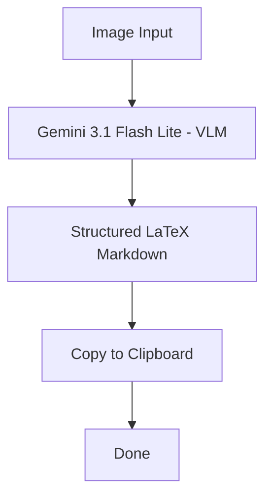

# LaTeX Converter

This project is a small Windows clipboard tool that reads an image from the clipboard, sends it to a vision-language model, and copies back plain text mixed with LaTeX for any formulas it finds.

## What It Does

- Converts screenshots or other clipboard images into text plus LaTeX formatted.
- Copies the result back to the clipboard so you can paste it anywhere.
- Useful to chat with LLM Chatbots without having to send them images to avoid rate-limits or their multimodal capability 

## Images Used

- This repo does not include committed sample images.
- I tested the app with clipboard screenshots of text and math formulas, such as a textbook-style page or notes containing equations.

## Workflow



## Prompt Used

The app uses this prompt when sending the clipboard image to Gemini:

> Convert the text and math formulas in this image into a mix of plain text and LaTeX. Use inline math ($...$) for inline formulas and display math ($$...$$) for standalone blocks. Use standards LaTeX syntax for all formulas. For example, use /exp(x) instead of e^x. If mutliple formulas are present on the same line, use $formula$. If mutliple formulas are present on different lines, you MUST use $$formula$$ in order to separate them. Output ONLY the exact result. Do not include markdown code blocks like ```latex or ```.

## Example Input and Output

- Example input: a clipboard screenshot containing the text `E = mc^2` and a paragraph with a fraction or integral.
- Example output: `Energy is given by $E = mc^2$.`
- Example output: `$$\int_0^1 x^2 \, dx = \frac{1}{3}$$`

## What I Used

- Vision-language model: Google Gemini via the `google-genai` library.
- Model used in the app: `gemini-3.1-flash-lite`.
- Helper tool: `list_available_models.py` to inspect available Gemini models.

## How to Run

1. Install dependencies:

```bash
pip install -r requirements.txt
```

2. Create a `.env` file with your API key:

```bash
GOOGLE_API_KEY=your_key_here
```

3. Start the app:

```bash
python app.py
```

4. Copy an image to the clipboard and press `Alt+C`.
5. Press `Esc` to quit.

## What I Asked AI To Help With

- AI suggested me good VLMs, yet gemini was the best as expected.
- AI taught me LaTeX standards and structered the initial prompt.
- AI built the ```show_popup``` function to notify the user without a terminal. 

## What I Changed, Fixed, or Improved Myself

- Built the architicture. 
- Built the clipboard hotkey flow around `Alt+C` and `Esc`.
- Added the model listing helper script.
- Replaced the initial Gemma 31B with Gemini 3.1 Flash Lite because Gemma had high demand.
- Added `requirements.txt` so the project can be installed cleanly.
- Modified the system prompt because the initial one wasn't working good.

## What I Learned

- Clipboard image workflows are useful for quick OCR-style tasks.
- Prompt wording matters a lot when you want clean LaTeX output.
- Small tooling details, like environment variables and dependency files, make the project easier to run and share.
- The more I depended on AI on previous projects, the harder it is for me to debug them. This project was mostly my work instead of AI work, so it was very easy for me to debug it.
- A simple useful idea is better than a complex but useless one.
## Requirements

- Python 3.10+
- A `GOOGLE_API_KEY` set in your `.env` file
